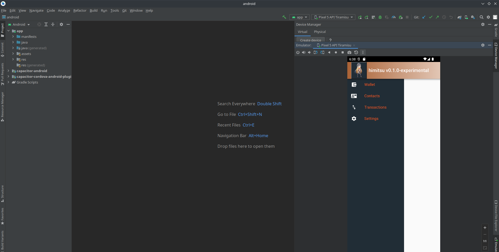

# himitsu client

[ POC / WIP ]

Lightweight Monero wallet and browser extension for quick interface with
monero-wallet-rpc and webxmr. 
Test bed for bleeding edge features (consensus wallet, swaps, etc.)

## Development

* New to Monero? Start [here](https://getmonero.org).
* Install node.js via [nvm](https://github.com/nvm-sh/nvm) (`nvm install 16` and `nvm use 16`)
* create a wallet name and password `himitsu` and mine / faucet some piconeros
* export environment variable `export REACT_APP_HIMITSU_DEV=DEV`
* if working on wallet init component, seed confirmation modal etc. don't export `REACT_APP_HIMITSU_DEV`
* pull the code from this [pull request](https://github.com/monero-project/monero/pull/8187), and compile it
* start `monerod` with `--stagenet` flag
* start `monero-wallet-rpc` with: `./path/to/monero-wallet-rpc --stagenet --wallet-dir /full/path/to/Monero/wallets/dev/ --rpc-bind-port 38083 --rpc-access-control-origins http://localhost:3000 --disable-rpc-login`
* there is a pre-compiled rpc binary (built on Fedora) for Linux X86_64 users, if you don't want to compile from source.
* initial setup => `git clone https://github.com/hyahatiph-labs/infosec.git && cd infosec/himitsu && npm i`
* start the client with `npm start`
* UI is located at localhost:3000 in your favorite browser
* works best to view in responsive 400 * 500

## Building

* build browser extension with `npm run build`
* open Brave (other browsers pending)
* extensions => "Load Unpacked"
* open the `build` directory

### Additional Notes

* there is a `Dockerfile` that can run with `docker build -t himitsu:v.0.1.0 .` from the infosec/himitsu directory
* if using the optimized build run `monero-wallet-rpc` with `./path/to/monero-wallet-rpc --stagenet --wallet-dir /full/path/to/Monero/wallets/dev/ --rpc-bind-port 38083 --rpc-access-control-origins "*" --disable-rpc-login`

## Testing

Sadly, non-existent. Pls halp!

## TODOs

Everything