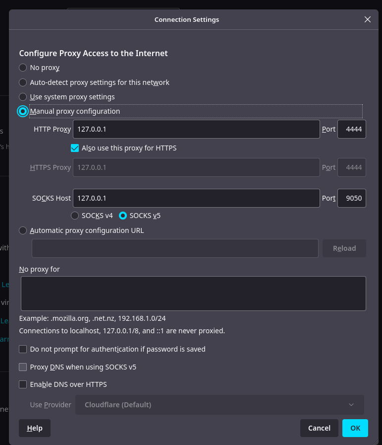
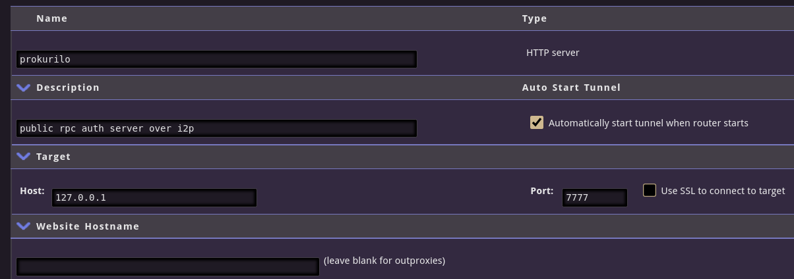

# Installation

This is a work in progress. Hope to make the installation process
more streamlined in the near future.

## App

* Experimental version in [Firefox App Store](https://addons.mozilla.org/en-US/firefox/addon/himitsu/)
* or build from source as shown in the readme

## I2P

* install from [i2p.net](https://geti2p.net/en/download)
* start i2prouter, e.g. `./i2p/i2prouter start`
* set browser proxy to `localhost:4444`

Example i2p proxy in Firefox (Settings => Network Settings)

## Prokurilo
 * in i2p create a hidden service for prokurilo
    * http://127.0.0.1:7657/i2ptunnelmgr
    * I2P Hidden Services => New Hidden Service "HTTP" => Create
 * after adding info with port, start the hidden service
 
 

* start monero-wallet-rpc `./build/Linux/no_rpc_aco_login/release/bin/monero-wallet-rpc --stagenet --wallet-dir /home/rimuru/Monero/wallets/dev --rpc-bind-port 38083 --disable-rpc-login`
* connect prokurilo to the local rpc instance
    * `git clone http://github./com/hyahatiph-labs/infosec.git && cd infosec/prokurilo`
    * `npm run clean && npm run build`
    * `node dist/prokurilo.js -a localhost:38083 -p 7777 -r 127.0.0.1:38083 -l INFO,WARN,ERROR --himitsu-rpc-restrict`
* enter the hidden service `.b32.i2p` address when starting the app (it can be found on the tunnel manager at http://127.0.0.1:7657/i2ptunnelmgr)
