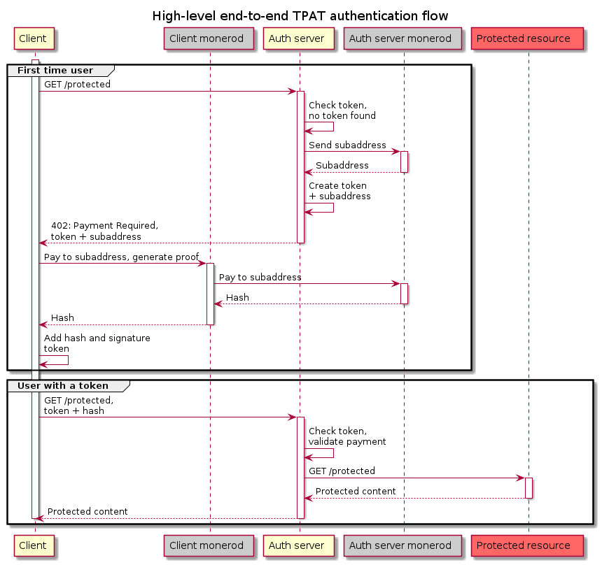

# Authentication Flow

This chapter explains the high-level authentication flow from the perspective of a user and their client software.

The requirements from the user's point of view are simple: They want to be able to use a service as frictionless as possible. They are perhaps used to the concept of needing to obtain an API access key first in order to use a service, but do not necessarily want to register an account with their personal information to do so.

A service using the TPAT protocol supports exactly that requirement: The use of an API key without the need for creating an account first. And because no information needs to be input, the process of obtaining the API key can happen transparently to the user, in the background. 

Whenever an TPAT-compatible client software connects to a server that uses the protocol, it receives a prompt to pay a subaddress over a very small amount \(a few piconeros + fee\). Once the client software pays that subaddress \(which can happen automatically if the amount does not exceed a user-defined threshold\), a valid API key or authentication token can be constructed. That token is stored by the client's software and will be used for all future requests.

## Detailed authentication flow

The following steps describe the diagram further below. It is the flow of calls that take place for a client software that wants to access a protected resource that is secured by an authentication server.  
As an example, we will look at the `xmr-price-proxy` client that wants to request data from the server.

**First time request**:

1. A user wishes to obtain price data with a GET request.

2. The call from the client must always go through the authentication server

   reverse proxy, which in this example is `prokurilo`. The authentication proxy

   notices that the client didn't send an TPAT and therefore cannot be granted

   access to the  server.

4. `prokurilo` sends back an associated `subaddress` to the asset.

5. In addition to the subaddress, `prokurilo` also sends a minimum amount and 

   time-to-live for the asset. The token is cryptographically constructed in a way that

   it is only valid once the subaddress has been paid.

6. The ttl, min_amt and subaddress are sent back to the client in the previously

   unused HTTP header `402 Payment Required`.

7. The `client` understands this returned error code, extracts the amount from

   it and automatically instructs its connected `monerod` instance to pay the

   amount and generate a transaction proof.

8. Paying the subaddress results in the client now possessing the

   cryptographic proof of payment \(the signature\). This proof is stored in the

   client's local storage, together with the hash.

9. The combination of the hash and the signature yields a fully valid

   TPAT that can be cryptographically verified.

10. The client now repeats the original request to the  server, now

    attaching the TPAT to the request.

11. The authentication server intercepts the request, extracts the TPAT and

    validates it. Because the TPAT is valid, the request is forwarded to the

    actual server that returns the data.

12. The whole process is fully transparent to the user. The only thing they

    might notice is a short delay of a few seconds on the first ever request.

**All further requests**:

1. For every new request to the server, the client now automatically attaches

   the token that is stored locally.

2. As long as the token has not expired, the steps 9-13 above will be followed.

   If/when the token expires, the server will start over at step 4 and instruct

   the client to obtain a fresh token.

